<h1 align="center">Hello there :D 👋</h1>
<!--  -->

<!-- stats graph -->

    

<!-- My GitHub stats -->

<!--  -->

<!--

<!--

 You can find more information <a href="https://kotikov.pages.dev">here</a>

<h1 align="center">Im currently working on: </h1>

<!-- Some of my repositories -->
<!--

<h1 align="center">My other repos </h1>

<!-- Some of my contacts -->

<!--
<h1 align="center">Wanna contact me? </h1>

<!-- footer -->
<!--

